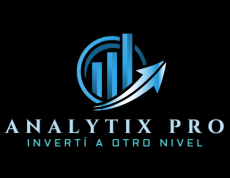

#  Analytix Pro 🚀

**Analytix Pro** es una aplicación web de análisis de inversiones construida con Streamlit, diseñada para guiar a inversores de todos los niveles a través de un flujo de trabajo profesional para la toma de decisiones financieras. La herramienta integra análisis fundamental, optimización de portafolios (Teoría de Markowitz), análisis estratégico de sectores, backtesting de rendimiento histórico y análisis técnico de puntos de entrada.

---

## ✨ Características Principales

La aplicación sigue un flujo de trabajo lógico para responder las preguntas clave de cualquier inversor:

1.  📊 **Análisis Fundamental (`¿Qué comprar?`)**:
    *   Comparativa de ratios clave de Valoración, Rentabilidad, Solvencia y Liquidez.
    *   Análisis IA para interpretar los puntos fuertes y débiles de cada empresa.

2.  ⚖️ **Optimización de Portafolio (`¿Cuánto comprar?`)**:
    *   Calcula la asignación de capital óptima para un conjunto de activos.
    *   Maximiza el Ratio de Sharpe basado en la Teoría Moderna de Portafolios de Markowitz.
    *   Visualización clara de los pesos asignados y la distribución del portafolio.

3.  🔬 **Análisis y Backtesting de Estrategia (`¿Por qué y cómo funcionó?`)**:
    *   **Análisis Sectorial:** Desglosa la composición del portafolio por sector industrial para entender su ADN.
    *   **Backtesting Histórico:** Simula el rendimiento de la estrategia en el pasado, mostrando métricas clave como Retorno Total, Máxima Caída (Max Drawdown) y un gráfico de crecimiento del capital.

4.  📈 **Análisis Técnico (`¿Cuándo comprar?`)**:
    *   Evalúa el momento actual del mercado para los activos del portafolio optimizado.
    *   Utiliza indicadores como RSI y Medias Móviles (SMA) para determinar si un activo está sobrecomprado, sobrevendido o en tendencia.

---

## 🛠️ Tecnologías Utilizadas

*   **Frontend:** Streamlit
*   **Análisis de Datos:** Pandas, NumPy
*   **Obtención de Datos Financieros:** yfinance
*   **Optimización de Portafolio:** PyPortfolioOpt
*   **Análisis Técnico:** pandas-ta
*   **Backtesting de Estrategia:** bt (Back-Testing)
*   **Visualización:** Plotly, Matplotlib

---

## 🚀 Despliegue y Acceso

Este proyecto está desplegado y es accesible públicamente a través de Streamlit Community Cloud.

**👉 [¡Prueba Analytix Pro aquí!](https://analytix-pro.streamlit.app/)**

*(Nota: Reemplaza `ENLACE-A-TU-APP-STREAMLIT` con el enlace real una vez que hayas desplegado la aplicación).*

---

## 📜 Licencia

Este proyecto se distribuye bajo una licencia propietaria. Todos los derechos reservados. Por favor, consulta el archivo `LICENSE` para más detalles.

Copyright (c) 2025 Analytix Pro.